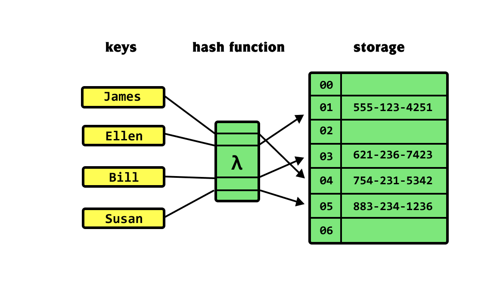

# table of contents
- 1. Linear list
    - 1.1) Array & Vector
    - 1.2) Linked list
    - 1.3) Stack Queue & Dequeue

- 2. Non-linear list
    - 2.1) Tree
        - 2.1.1) Binary Tree
        - 2.1.2) Set & Map
        - 2.1.3) MultiSet
        - 2.1.4) MultiMap
        - 2.1.5) Unorderedmap
    - 2.2) Heap (Priority Queue)
    - 2.3) DSU (Disjoint Set)

# Data structure
Data structure เป็นสิ่งช่วยในการจัดเก็บจัดการ และเข้าถึงข้อมูลอย่างมีประสิทธิภาพ ทำให้การแก้ปัญหาสามารถทำได้เร็วและมีประสิทธิภาพมากขึ้น ยกตัวอย่างเช่น heap ที่สามารถเพิ่มลบ/ค้นหา ตัวเลขได้ในเวลา ```O(log n)``` เป็นต้น

โดยเราไม่จำเป็นต้องสร้าง Data Structures ขึ้นมาเอง เราสามารถใช้ Standard Template Library (STL) ที่ภาษา C++ มีให้ เพราะฉะนั้นหัวข้อนี้จะอธิบายแค่เพื่อให้เข้าใจว่าสามารถใช้งานได้อย่างไร เราจะไม่ลงรายละเอียดถึงส่วนละเอียดเล็กๆ สำหรับข้อมูลเพิ่มเติม สามารถค้นหาจากอินเทอร์เน็ตได้

# Linear list

# 1.1) Array & Vector
## 1.1.1) Array
Array เป็นโครงสร้างข้อมูลที่สมาชิกมีประเภทเดียวกันและ สามารถเข้าถึงได้โดยใช้ตำแหน่งของสมาชิก (zero-base index)
- การเข้าถึงและอัปเดตสมาชิกในเวลา O(1)
- การค้นหา การแทรก และการลบสมาชิกจะใช้เวลา O(n)
## 1.1.2) Vector in C++
Vector มีความคล้ายกับ Array แต่ต่างกันตรงที่สามารถเปลี่ยนขนาดได้โดยอัตโนมัติ ซึ่งจะมีความเหมาะกับโจทย์จำพวก graph มากกว่า เพราะเราไม่สามารถกำหนด fixed size array ได้
``` cpp
    std::vector<int> V;
    V.push_back(10);
    V.push_back(20);
    V.push_back(30);
    V.pop_back();

    V.insert(V.begin() + 1, 15);

    for(std::vector<int>::iterator it = V.begin(); it != V.end(); it++)
        std::cout << *it << std::endl;
    # 10 15 20

    V.erase(std::remove(V.begin(), V.end(), 15), V.end());
    for(auto it : V)
        std::cout << it << std::endl;
    # 10 20
```
ซึ่งถ้าเราสังเกตก็จะพบว่า เราสามารถเลือกวิธีเพิ่ม/ลดข้อมูลให้เหมาะสมกับโจทย์ได้
- push_back(x) ใช้เวลา O(1)
- insert(V.begin() + n , x) โดยที่ n คือตำแหน่ง index ถ้าหลัง index n มี values อยู่ก็จะเลื่อนทุกตัวไปหนึ่งตำแหน่ง ซึ่งจะใช้เวลา O(n)
- pop_back() ใช้เวลา O(1)
- erase(V.begin() + n, V.begin() + m) โดยที่ n คือตำแหน่ง index ลบตั้งแต่ index [n, m) หรืออาจจะใช้ std::remove(V.begin(), V.end(), x) เพื่อลบเฉพาะค่านั้นๆได้ ใช้เวลา O(n)

วิธีใช้เพิ่มเติมสามารถอ่านจาก อินเตอร์เน็ต <https://www.geeksforgeeks.org/vector-in-cpp-stl/> ได้

# 1.2) Linked List
Linked List เป็นลำดับของโครงสร้างข้อมูลที่เชื่อมต่อกันผ่านลิงก์ เป็นการจัดสร้างพื้นที่หน่วยความจำแบบไดนามิก
- การเข้าถึงและค้นหาข้อมูลใช้เวลา O(n)
- การเพิ่มและลบข้อมูลสามารถทำได้ในระยะเวลา O(1) หากทราบโนดที่ต้องการ

ซึ่งโจทย์ TOI ส่วนใหญ่ไม่ค่อยมีเกี่ยวกับตัวของ linked list ผมจึงขอข้ามการ implement ครับ ถ้าอยากรู้เพิ่มเติมสามารถอ่านได้ที่ <https://www.geeksforgeeks.org/data-structures/linked-list/>

# 1.3) Stack Queue & Dequeue
หลักการทั้ง 3 ชนิดจะมีความคล้ายกับ linked list อยู่พอสมควร แต่ต่างกันตรงที่ data structure ทั้ง 3 ชนิดสามารถใช้จาก STL ได้เลย แต่ตัวของ linked list ต้อง implement เอง นอกจากนี้จะเป็นเรื่อง Top Node ที่ทำให้การใช้งานแตกต่างกัน โดยเรื่องของ time complexity จะเหมือนกับ linked list เลย
- การเพิ่มและการลบข้อมูล (push & pop) ใช้เวลา O(1)
- การเข้าถึงและการค้นหาจะใช้เวลา O(n) 
## 1.3.1) Stack 
Stack มีประโยชน์สำหรับตอนที่ต้องการเข้าถึงรายการโดยจำลำดับของการแทรก ซึ่งนิยมใช้ใน DFS(Depth-First Search จะมีอธิบายในหัวข้อ Graph implementation) ข้อมูลลักษณะนี้มีชื่อก็คือ LIFO (Last in, First out) เข้าหลัง->แต่ออกก่อน ซึ่งวิธีใช้ก็ไม่ยาก
```cpp
    std::stack<int> myStack;

    myStack.push(10);
    myStack.push(20);
    cout << myStack.top() 
    # 20
    myStack.pop();
    cout << myStack.top()
    # 10
```
## 1.3.2) Queue
Queue มีความคล้ายกับ Stack แต่ต่างกันตรงที่ queue เป็นข้อมูลแบบ FIFO (First in, First out) เข้าก่อน->ออกก่อน ซึ่งนิยมใช้ใน BFS(Breadth-First Search จะมีอธิบายในหัวข้อ Graph implementation)
```cpp
    std::queue<int> myQueue;

    myQueue.push(10);
    myQueue.push(20);
    cout << myQueue.front() 
    # 10
    myQueue.pop();
    cout << myQueue.front()
    # 20
```
## 1.3.3) Dequeue
Dequeue ก็คล้ายกับ Queue แต่มีสิ่งที่พิเศษก็คือ รองรับการเพิ่ม/ลบข้อมูลจากทั้งด้านหน้าและด้านหลังได้ สามารถใช้แทน Stack กับ Queue ได้
```cpp
    std::deque<int> my_deque;

    my_deque.push_back(10);
    my_deque.push_back(20);
    my_deque.push_front(40);

    for (int i : my_deque) {
        std::cout << i << ' ';
    } # 40 10 20
    my_deque.pop_front();
    my_deque.pop_back();

    for (int i : my_deque) {
        std::cout << i << ' ';
    } # 10
```
# 2.Non-linear list
# 2.1) Tree

Sets และ Maps ใช้เก็บ data ที่มีความ unique หรือเป็นแบบ key-value ด้วย time complexity ```O(log n)``` ซึ่งสำคัญมากๆ ในโจทย์ที่สนใจด้านเวลานั่นเอง
# 2.1.1) Set
Set เหมือนกับ Set ที่เราเคยเรียนในตอนม.ปลาย ก็คือจัดเก็บข้อมูลที่ไม่ซ้ำกันโดยไม่สนลำดับ เวลาที่ใช้การเพิ่ม/ลบ และการค้นหาจะเร็วกว่าใน vector หรือ list เนื่องจากถูกสร้างขึ้นเป็น BBST(balance binary search trees) ทำให้ใช้เวลาในการเพิ่ม/ลบและค้นหาเพียงแค่ `O(log n)`
```cpp
    std::set<int> mySet;
    mySet.insert(30);
    mySet.insert(10);
    mySet.insert(20);
    // insert duplicate values
    mySet.insert(20);

    for (auto it : mySet)
        std::cout << ' ' << *it;
    # 10 20 30
```
ซึ่งถ้าสังเกต output ก็จะพบว่าข้อมีการ sort หลังจากใส่ข้อมูล เพราะเป็น BBST ที่กล่าวไปในตอนต้น ซึ่งวิธี implement BBST สามารถหาจากอินเตอร์เน็ตได้
# 2.1.2) Map
Map ใน C++ เป็นโครงสร้างข้อมูลที่ใช้เพื่อเก็บค่า key-value โดยที่ key ต้องไม่ซ้ำกัน. การเข้าถึงข้อมูลใน map จะใช้ key เป็นตัวอ้างอิง ทำให้การค้นหาข้อมูลใน map มีประสิทธิภาพ

```cpp
    std::map<int, std::string> myMap;
    myMap[1] = "one";
    myMap[2] = "two";
    myMap[3] = "three";

    for(auto& pair : myMap) {
        std::cout << pair.first << ": " << pair.second << std::endl;
    }
    # 1: one
    # 2: two
    # 3: three
```
# 2.1.3) Multiset
Multiset คือ set ที่สามารถเก็บค่าที่ซ้ำกันได้ แต่ยังคงเรียงลำดับข้อมูลไว้
```cpp
    std::multiset<int> mset;
    mset.insert(10);
    mset.insert(20);
    mset.insert(10);
    for(auto value : mset) {
        std::cout << value << ' ';
    }
    # 10 10 20
```
# 2.1.4) Multimap
Multimap คือ map ที่อนุญาตให้มี key ที่ซ้ำกันได้ แต่ค่า value สามารถแตกต่างกันได้.

```cpp
    std::multimap<int, std::string> mmap;
    mmap.insert({1, "one"});
    mmap.insert({2, "two"});
    mmap.insert({1, "uno"});
    for(auto& pair : mmap) {
        std::cout << pair.first << ": " << pair.second << std::endl;
    }
    # 1: one
    # 1: uno
    # 2: two
```

# 2.1.5) Unorderedmap
Unordered_map เป็นโครงสร้างข้อมูลที่มีการเก็บข้อมูลแบบ key-value แบบเดียวกับ map แต่ไม่มีการเรียงลำดับข้อมูล โดยการทำงานแบบนี้ถูกเรียกว่า `hash table`​​


```cpp
    std::unordered_map<int, std::string> umap;
    umap[1] = "one";
    umap[2] = "two";
    umap[3] = "three";
    for(auto& pair : umap) {
        std::cout << pair.first << ": " << pair.second << std::endl;
    }
    # Output can be in any order due to its unordered nature.
```

# 2.2) Priority_queue
Priority_queue เป็นโครงสร้างข้อมูลที่ให้การเข้าถึงข้อมูลที่มีความสำคัญสูงสุดหรือต่ำสุดในเวลา เป็นโครงสร้างข้อมูลที่มีประโยชน์มากใน algorithm ที่มีการใช้ greedy ซึ่งจะมีพูดถึงใน [algorithm](2-Algorithm.md) 
- ในการเข้าถึงข้อมูลที่มีความสำคัญที่สุดจะใช้เวลา  `O(1)` 
- การเพิ่มหรือลบข้อมูลจะใช้เวลา `O(log n)`
```cpp
    std::priority_queue<int> pq;
    pq.push(10);
    pq.push(30);
    pq.push(20);
    std::cout << pq.top(); # 30
```

## เปรียบเทียบกับโครงสร้างข้อมูลชนิดอื่น:
| Data Structure | Insertion | Access (Min/Max) | Deletion (Min/Max) |
|----------------|-----------|------------------|--------------------|
| Array     | `O(1)` | `O(n)` | `O(n)` |
| Stack / Queue / Dequeue | `O(1)` |`O(n)` | `O(n)` |
| Balanced BST (e.g., Set, Map) | `O(log n)` | `O(log n)` | `O(log n)` |
| Hash Tables (e.g., Unordered_map) | `O(1)` (average) | `O(n)` | `O(1)` (average) |
| Priority_queue | `O(log n)` | `O(1)` | `O(log n)` |

# 2.3) DSU (Disjoint Set)
DSU หรือ Disjoint Set Union เป็นโครงสร้างข้อมูลที่ใช้เพื่อจัดการกับการรวมหรือการตรวจสอบว่าสอง elements อยู่ในเซ็ตเดียวกันหรือไม่ นิยมใช้มากในเรื่องของ `graph` เพราะ เข้าใจได้ง่ายและ implement ง่าย


วิธีใช้ DSU แบ่งออกเป็น 3 ส่วนคือ
- initialization:
แต่ละ component จะต้องมีตัวแทนของเซ็ตของตัวเอง (representative) ดังนั้นแรกเริ่มจำเป็นต้องเป็นตัวแทนของตัวเอง โดยเราใช้ array หรือ vector เพื่อเก็บตัวแทน นิยมเรียกว่า `parent`
```cpp
    // initialization
    int n = 5;
    std::vector<int> parent(n), rank(n, 0);
    for(int i = 0; i < n; i++) parent[i] = i;
```
- union:
ตรวจสอบว่าองค์ประกอบที่กำหนดอยู่ในเซ็ตใด โดยจะตรวจสอบตัวแทนของเซ็ต หาก ตัวแทนของเซ็ต นั้นไม่ได้เป็นตัวเอง `(parent[x] != x)`, มันจะทำการเรียก find อีกครั้งเพื่อหาตัวแทนและอัปเดตค่า `parent[x]` ให้เป็นตัวแทนนั้น เพื่อลดความซับซ้อนของการค้นหาในอนาคต.
```cpp
    // find function to get the representative of the set
    int find(int x) {
        if(parent[x] != x) parent[x] = find(parent[x]);
        return parent[x];
    }
```
- find operations:
รวมสองเซ็ตเข้าด้วยกัน โดยใช้ตัวแทนของแต่ละเซ็ตที่ได้จากการ find. หากตัวแทนทั้งสองไม่เหมือนกัน เราจะทำการรวมเซ็ตโดยอัปเดต parent ของตัวแทนหนึ่งเซ็ตเพื่อชี้ไปยังตัวแทนของอีกเซ็ตหนึ่ง  (`parent[b] = a`)
```cpp
    // union function to join two sets
    void union_sets(int a, int b) {
        a = find(a);
        b = find(b);
        if(a != b) {
            parent[b] = a;
        }
    }
```
Noted: สามารถศึกษาเพิ่มเติมเกี่ยวกับ DSU ได้ที่ https://cp-algorithms.com/data_structures/disjoint_set_union.html
