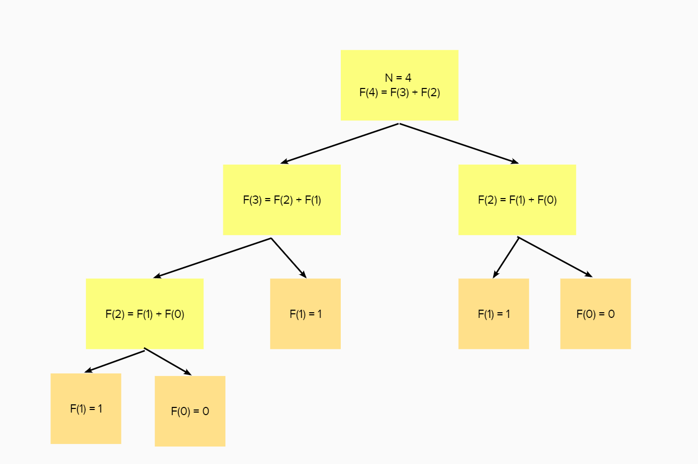

# table of contents
- 1. Brute Force
    - 1.1) Linear Search
    - 1.2) Simulation
- 2. Divide & Conquer
    - 2.1) Binary Search
- 3. Dynamic programming
    - 3.1) Bottom-Up & Top-Down Dynamic Programming
        - 3.1.1) Fibonacci Sequence
        - 3.1.2) Number Partitioning
    - 3.2) Longest Common Subsequence (LCS)
    - 3.3) Knapsack Problems
        - 3.3.1) 0/1 Knapsack
        - 3.3.2) Fractional Knapsack
        - 3.3.3) Multi-dimensional Knapsack
    - 3.4) Shortest Path Problems
    - 3.5) Coin Change Problems
    - 3.6) Subset Sum Problems
    - 3.7) Longest Increasing Subsequence (LIS)
    - 3.8) Traveling Salesman Problem (TSP)
    - 3.9) Bitmasking and DP
    - 3.10) Dynamic Programming on Trees

# 1. Brute Force

## 1.1) Linear Seach

# 2. Binary Search

# 3. Dynamic programming (DP)
Dynamic programming เป็น algorithm ที่ค่อนข้างสำคัญ ในสาย competitive programming แล้วมันคืออะไรละ มันคืออัลกอริทึมที่แบ่งงานทั้งหมดเป็นงานย่อยๆ ซึ่งตัว DP สามารถเลี่ยงการคำนวณที่ซับซ้อน​ของการเขียนแบบ `brute force` ได้

## 3.1) Bottom-Up & Top-Down Dynamic Programming
#### Bottom-Up Dynamic Programming
Bottom-up Dynamic Programming คือการแก้ปัญหาโดยเริ่มจากกรณีง่ายที่สุด​ (base) แล้วแก้ปัญหานั้น จากนั้นใช้คำตอบของปัญหานั้นเพื่อแก้ปัญหาที่ซับซ้อนขึ้น

#### Top-Down Dynamic Programming (Memoization)
Top-Down Dynamic Programming คือการแก้ปัญหาโดยการแบ่งปัญหาออกเป็นปัญหาย่อยที่ง่ายขึ้น ต่างจากเขียนแบบ Bottom-Up ตรงที่มันเริ่มจากปัญหาที่ซับซ้อนและแบ่งปัญหาออกจนถึงกรณีที่ง่ายที่สุด ซึ่งจะมีตัวอย่างของ 2 วิธีให้ดูในปัญหาข้างล่างนี้

### 3.1.1 Fibonacci Sequence
โดยปกติแล้วถ้าเราจะหา fibonacci นั้นเราก็แค่เขียน recursive function ซึ่งจะเป็นดังนี้
```cpp
int fib(int n) {
    if (n < 2)
        return 1;
    return fib(n-1) + fib(n-2);
}
```
เราจะเห็นว่าการเขียนแบบ recursive ตรงๆนั้นสามารถเขียนได้ค่อนข้างง่าย แต่ข้อเสียของมันคือมันก็การคำนวณที่ซับซ้อน โดยดูจากตัวอย่างภาพด้านล่าง

สมมุติถ้าเราจะคำนวณหา `F[4]` เราจำเป็นต้องคำนวณ `F[2]` ถึง 2 รอบ​ `O(2^n)`​ มันจะดีกว่าไหม ถ้าเราสามารถเขียนโดยคำนวณ `F[2]` แค่รอบเดียว​​ ซึ่งวิธีการนั้นก็คือ การนำ Dynamic Programming มาประยุกต์ใช้นั่นเอง โดยตัวอย่างแรก จะเป็นการเขียนแบบ Top-Down DP

```cpp
//Top-Down method
int fib(int n) {
    vector <int> F(n + 1);
    F[0] = 0;
    F[1] = 1;
    for (int i = 2; i <= n; i++) {
        F[i] = F[i-1] + F[i-2];
    }
    return F[n];
}

int main() {
    int n = 10;
    cout << fib(n) << endl;  // Output: 55
    return 0;
}
```
หลังจากเขียนแบบ DP พบว่า ใช้เวลาเพียงแค่ `O(n)` เท่านั้นในครั้งแรกที่คำนวณ แล้วถ้าคำนวณต่อด้วยค่า ที่น้อยกว่า n (n2 < n) ก็จะใช้เวลาเพียงแค่ `O(1)`

ส่วนวิธีเขียนแบบ Bottom-Up นั้นก็ไม่ยากเพียงเขียน initial state เริ่มต้นเหมือนตอนเขียน recursive แล้วสร้าง array สำหรับเก็บค่า และ state ที่คำนวณไปแล้ว ซึ่งจะได้ประมาณนี้
```cpp
//Bottom-Up method
vector <int> F(N + 1);
vector <bool> visited(N + 1);

int fib(int n) {
    // initial state
    if(n < 2)
        return (1);

    if(visited[n])
        return F[n];
    visited[n] = true;
    F[n] = fib(n - 1) + fib(n - 2);
    return F[n];
}

int main() {
    int n = 10;
    cout << fib(n) << endl;  // Output: 55
    return 0;
}
```

แล้วถ้าถามว่า Bottom-Up กับ Top-Down Dynamic Programming (DP) มักขึ้นอยู่กับลักษณะของโจทย์ ความเข้าใจในปัญหา และความชอบของคนเขียน ดังนี้

| Factors             | Bottom-Up                                           | Top-Down                                         |
|---------------------|-----------------------------------------------------|--------------------------------------------------|
| ความเข้าใจในปัญหา       | - ง่ายต่อการเข้าใจโครงสร้างจากกรณีง่าย | - ง่ายต่อการแบ่ง problem เป็น sub-problems ที่ง่ายขึ้น |
|                     | -  เหมาะสำหรับปัญหาที่มีโครงสร้างชัดเจนในการสร้างขึ้นจาก base cases | - เหมาะสำหรับปัญหาที่การใช้ recursion ช่วยให้เข้าใจโจทย์ได้ง่ายขึ้น|
| ความชอบของคนเขียน | - เหมาะกับคนที่ถนัดการเขียนแบบ loop | - เหมาะกับคนที่ถนัดการเขียนแบบ recursive function |
| Performance         | - เรื่องของประสิทธิภาพนั้นขึ้นอยู่โจทย์นั้นๆเลย เพราะการเขียนทั้งสองแบบ อาจจะสามารถหลีกเลี่ยงการคำนวณบาง sub-problems ที่ไม่จำเป็นได้ ||
| Memory Usage        | - อาจจะใช้ memory มากกว่าในบางกรณี เพราะต้อง allocate memory สำหรับทั้งหมด | - มีโอกาสที่จะใช้ memory น้อยลง ด้วยการเรียก recursive แต่ไม่ได้เสมอไปเพราะว่า stack overstack |


สรุปแล้ว, การเลือกใช้ Bottom-Up หรือ Top-Down DP นั้นขึ้นอยู่กับลักษณะของโจทย์และผู้ใช้งาน ทั้งนี้การลองเขียน และประสบการณ์จะช่วยให้เราเลือกได้ว่าวิธีไหนทำงานมากที่สุด สำหรับโจทย์นั้นๆครับ
## 3.1.2) Number Partitioning
การแบ่งหมู่เลขคือปัญหาในการตัดสินใจว่าหมู่เลขจำนวนเต็มบวกที่กำหนดสามารถแบ่งได้เป็นสองหมู่ย่อย S1 และ S2 โดยที่ผลรวมของหมู่เลขใน S1 เท่ากับผลรวมของหมู่เลขใน S2 หรือไม่
